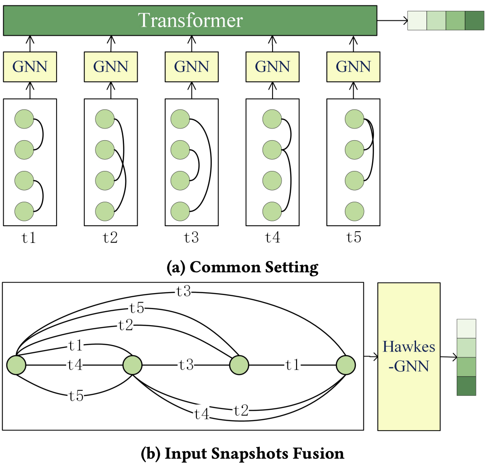

<h1 align="center">Input Snapshots Fusion for Scalable Discrete Dynamic Graph Neural Networks</h1>
<p align="center">
    <a href="https://arxiv.org/pdf/2405.06975"></a>  <!--  修改2处arxiv URL -->
    <a href="https://github.com/oncemoe/hawkesGNN/"></a>  <!--  修改githubURL -->
    <a href="https://arxiv.org/pdf/2405.06975"></a>  <!--  修改arxiv URL, 发布信息-->
    <a href="https://github.com/oncemoe/hawkesGNN/blob/main/LICENSE">
</a>

## 📖 Overview
Snapshots serve as the foundation of discrete dynamic graphs. The conventional approach involves processing individual snapshots separately before attempting to merge them. This repository proposes an alternative methodology by initially merging multiple snapshots and subsequently modeling directly on the generated temporal graph.

<div align=center>
    
</div>

## ⚡️ Quickstart

- Environment Setup: 
    1. Create a `data` folder and a `log` folder in the main directory for the input data and log output.
    2. Run `pip install -r requirements.txt` to install necessary dependences.

- Example: to get started, run `python main.py`. It will automatically download `BitcoinOTC` dataset and run training and evaluation.

- Run `bash scripts/run_all.sh`, which contains main scripts for our experiments. For more arguments please refer to `main.py`.

## 🔎 Citation
If you find this repository helpful, please cite our preprint.

```
@article{inputhawkesgnn,
      title = {Input Snapshots Fusion for Scalable Discrete Dynamic Graph Neural Networks},
      author = {QingGuo Qi, Hongyang Chen, Minhao Cheng, and Han Liu},
      journal = {arXiv preprint arXiv:2405.06975},
      url = {https://arxiv.org/pdf/2405.06975},
      year = {2024}
}
```